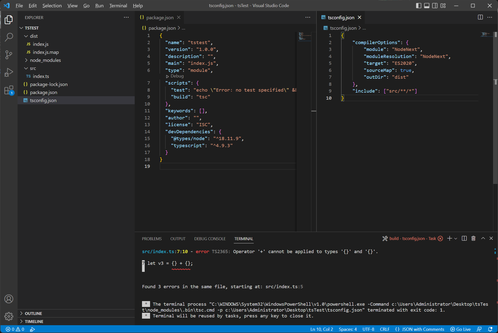
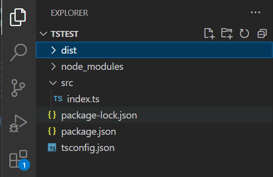
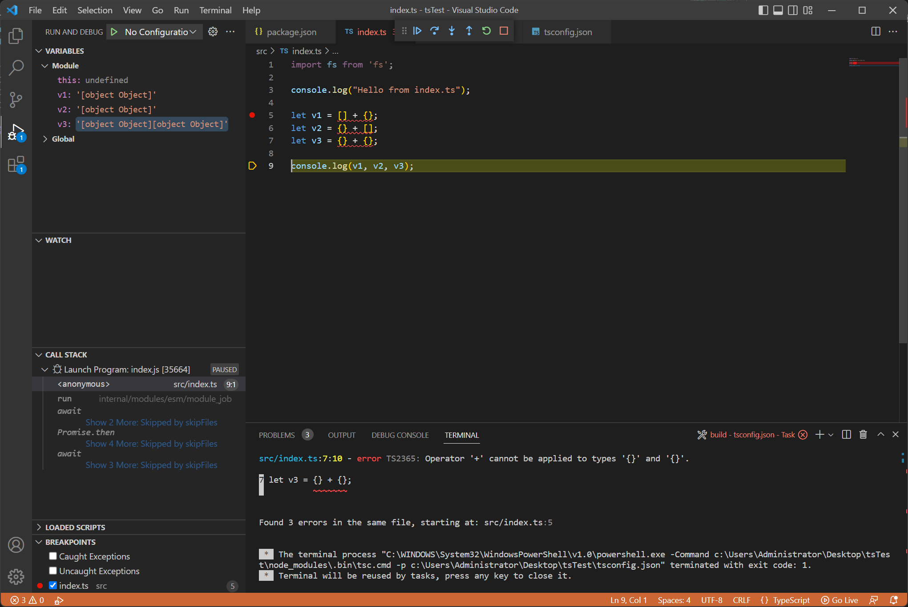

# TypeScript Development with VSCode
This mainly serves as a reminder or "reference" to create a project and be able to debug it within VSCode. 
Share it freely if you find this helpful.

## Prepreation
### Install node and npm
Open a powershell/cmd, and type
```
winget install Node.js
```
### Install VSCode

### Create a project
Create a folder which contains your project, open a terminal there and type 
```
npm init -y
npm i typescript --save-dev
npm i -D @types/node
```

where `-y` means [continues without asking any questions](https://docs.npmjs.com/cli/v9/commands/npm-init#yes).
And you should see this and a `package.json` created under the folder.

### Modify `package.json`
1. Change `"type": "script"` -> `"type": "module"`, which would enable the ES module syntax, so you can use `import` instead of `require`, when using a module.
2. Under the `scripts` object, add `"build": "tsc"`, which would run the typescript compiler when `build` task is executed.

Your `package.json` should look like this
```json
{
  "name": <Your project name>
  "version": "1.0.0",
  "description": "",
  "main": "index.js",
  "type": "module",
  "scripts": {
    "test": "echo \"Error: no test specified\" && exit 1",
    "build": "tsc"
  },
  "keywords": [],
  "author": "",
  "license": "ISC",
  "devDependencies": {
    "@types/node": "^18.11.9",
    "typescript": "^4.9.3"
  }
}
```

### Create `tsconfig.json`
Create `tsconfig.json` file, and copy the following content
```json
{
    "compilerOptions": {
        "module": "NodeNext",
        "moduleResolution": "NodeNext",
        "target": "ES2020",
        "sourceMap": true,
        "outDir": "dist"
    },
    "include": ["src/**/*"]
}
```

Now you should have your two `json` files like this


### Create source files
Create a folder named `src`, and in inside it, create your `index.ts`, like this


Now you should be able to run and debug with `F5` inside VsCode.


